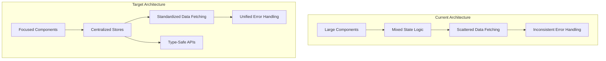
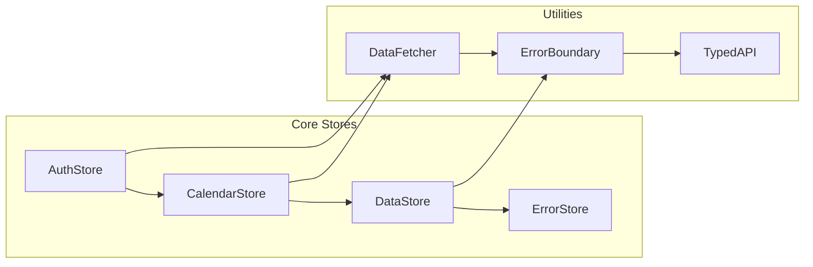

# Svelte Refactoring Design Document

## Overview

This document outlines the technical design for refactoring the Trenara web application to improve maintainability, leverage Svelte 5 features, and implement more "Svelte-like" patterns. The refactoring will be implemented in phases to minimize disruption while maximizing benefits.

## Architecture

### High-Level Architecture Changes



### Store Architecture



## Components and Interfaces

### 1. Calendar Store Design

```typescript
// src/lib/stores/calendar.store.ts
export interface CalendarStore {
  // State
  readonly currentDate: Date;
  readonly selectedDate: CalendarDate | null;
  readonly isLoading: boolean;
  readonly schedule: Schedule | null;
  
  // Derived State
  readonly selectedDateString: string | null;
  readonly filteredTrainings: ScheduledTraining[];
  readonly filteredStrengthTrainings: StrengthTraining[];
  readonly monthData: MonthData;
  
  // Actions
  setCurrentDate(date: Date): void;
  setSelectedDate(date: CalendarDate | null): void;
  loadMonthData(date: Date): Promise<void>;
  refreshData(): Promise<void>;
  
  // Navigation
  goToNextMonth(): void;
  goToPreviousMonth(): void;
  goToToday(): void;
}

export function createCalendarStore(initialDate: Date): CalendarStore {
  let currentDate = $state(initialDate);
  let selectedDate = $state<CalendarDate | null>(null);
  let isLoading = $state(false);
  let schedule = $state<Schedule | null>(null);
  
  // Derived state using $derived
  let selectedDateString = $derived(
    selectedDate 
      ? formatDateString(selectedDate)
      : null
  );
  
  let filteredTrainings = $derived(
    schedule?.trainings.filter(t => 
      t.day_long === selectedDateString
    ) ?? []
  );
  
  // Actions
  const setCurrentDate = (date: Date) => {
    currentDate = date;
  };
  
  const loadMonthData = async (date: Date) => {
    isLoading = true;
    try {
      const data = await fetchMonthSchedule(date);
      schedule = data;
    } catch (error) {
      // Handle error through error store
    } finally {
      isLoading = false;
    }
  };
  
  return {
    get currentDate() { return currentDate; },
    get selectedDate() { return selectedDate; },
    get isLoading() { return isLoading; },
    get schedule() { return schedule; },
    get selectedDateString() { return selectedDateString; },
    get filteredTrainings() { return filteredTrainings; },
    
    setCurrentDate,
    setSelectedDate: (date) => selectedDate = date,
    loadMonthData,
    // ... other methods
  };
}
```

### 2. Authentication Store Design

```typescript
// src/lib/stores/auth.store.ts
export interface AuthStore {
  // State
  readonly user: User | null;
  readonly isAuthenticated: boolean;
  readonly isLoading: boolean;
  readonly error: AuthError | null;
  
  // Actions
  login(credentials: LoginCredentials): Promise<void>;
  logout(): Promise<void>;
  refreshToken(): Promise<boolean>;
  clearError(): void;
}

export function createAuthStore(): AuthStore {
  let user = $state<User | null>(null);
  let isLoading = $state(false);
  let error = $state<AuthError | null>(null);
  
  let isAuthenticated = $derived(!!user);
  
  const login = async (credentials: LoginCredentials) => {
    isLoading = true;
    error = null;
    try {
      const result = await authService.login(credentials);
      user = result.user;
    } catch (err) {
      error = err as AuthError;
    } finally {
      isLoading = false;
    }
  };
  
  return {
    get user() { return user; },
    get isAuthenticated() { return isAuthenticated; },
    get isLoading() { return isLoading; },
    get error() { return error; },
    
    login,
    logout: async () => {
      await authService.logout();
      user = null;
    },
    refreshToken: () => authService.refreshToken(),
    clearError: () => error = null
  };
}
```

### 3. Data Fetching Utilities

```typescript
// src/lib/utils/data-fetching.ts
export interface AsyncData<T> {
  readonly data: T | null;
  readonly loading: boolean;
  readonly error: Error | null;
  load(): Promise<void>;
  reload(): Promise<void>;
  reset(): void;
}

export function createAsyncData<T>(
  fetcher: () => Promise<T>,
  options: AsyncDataOptions = {}
): AsyncData<T> {
  let data = $state<T | null>(null);
  let loading = $state(false);
  let error = $state<Error | null>(null);
  
  const load = async () => {
    if (loading) return; // Prevent concurrent loads
    
    loading = true;
    error = null;
    
    try {
      data = await fetcher();
    } catch (err) {
      error = err as Error;
      if (options.onError) {
        options.onError(error);
      }
    } finally {
      loading = false;
    }
  };
  
  return {
    get data() { return data; },
    get loading() { return loading; },
    get error() { return error; },
    load,
    reload: load,
    reset: () => {
      data = null;
      error = null;
      loading = false;
    }
  };
}

// Usage in components
export function useScheduleData(date: Date) {
  return createAsyncData(() => fetchMonthSchedule(date));
}
```

### 4. Component Composition

```svelte
<!-- src/lib/components/calendar/Calendar.svelte -->
<script lang="ts">
  import { createCalendarStore } from '$lib/stores/calendar.store.js';
  import CalendarProvider from './CalendarProvider.svelte';
  import CalendarHeader from './CalendarHeader.svelte';
  import CalendarGrid from './CalendarGrid.svelte';
  import CalendarDetails from './CalendarDetails.svelte';
  
  let { initialDate, schedule } = $props<{
    initialDate: Date;
    schedule: Schedule;
  }>();
  
  const calendarStore = createCalendarStore(initialDate);
</script>

<CalendarProvider store={calendarStore}>
  <div class="calendar-container">
    <CalendarHeader />
    <CalendarGrid />
    <CalendarDetails />
  </div>
</CalendarProvider>
```

```svelte
<!-- src/lib/components/calendar/CalendarProvider.svelte -->
<script lang="ts">
  import { setContext } from 'svelte';
  import type { CalendarStore } from '$lib/stores/calendar.store.js';
  
  let { store, children } = $props<{
    store: CalendarStore;
    children: any;
  }>();
  
  setContext('calendar', store);
</script>

{@render children()}
```

### 5. Error Handling System

```typescript
// src/lib/utils/error-boundary.ts
export interface ErrorBoundary {
  readonly error: Error | null;
  readonly hasError: boolean;
  handleError(error: Error): void;
  clearError(): void;
  retry?(): Promise<void>;
}

export function createErrorBoundary(
  retryFn?: () => Promise<void>
): ErrorBoundary {
  let error = $state<Error | null>(null);
  
  let hasError = $derived(!!error);
  
  const handleError = (err: Error) => {
    error = err;
    console.error('Component error:', err);
    
    // Optional error reporting
    if (typeof window !== 'undefined' && window.reportError) {
      window.reportError(err);
    }
  };
  
  return {
    get error() { return error; },
    get hasError() { return hasError; },
    handleError,
    clearError: () => error = null,
    retry: retryFn ? async () => {
      error = null;
      try {
        await retryFn();
      } catch (err) {
        handleError(err as Error);
      }
    } : undefined
  };
}
```

## Data Models

### Enhanced Type Definitions

```typescript
// src/lib/types/calendar.ts
export interface CalendarDate {
  year: number;
  month: number;
  day: number;
}

export interface CalendarState {
  currentDate: Date;
  selectedDate: CalendarDate | null;
  daysInMonthWithOffset: number[];
  firstDayOfMonth: number;
  offsetAtEnd: number;
  offsetAtStart: number;
}

export interface TrainingStatus {
  type: 'run' | 'strength';
  status: 'none' | 'scheduled' | 'completed' | 'missed';
  date: string;
}

// src/lib/types/auth.ts
export interface User {
  id: string;
  email: string;
  name?: string;
}

export interface AuthError {
  code: string;
  message: string;
  details?: Record<string, any>;
}

export interface LoginCredentials {
  email: string;
  password: string;
}
```

## Error Handling

### Centralized Error Management

```typescript
// src/lib/stores/error.store.ts
export interface ErrorStore {
  readonly errors: AppError[];
  readonly hasErrors: boolean;
  addError(error: AppError): void;
  removeError(id: string): void;
  clearErrors(): void;
}

export interface AppError {
  id: string;
  type: 'auth' | 'network' | 'validation' | 'unknown';
  message: string;
  timestamp: Date;
  context?: Record<string, any>;
}

export function createErrorStore(): ErrorStore {
  let errors = $state<AppError[]>([]);
  
  let hasErrors = $derived(errors.length > 0);
  
  return {
    get errors() { return errors; },
    get hasErrors() { return hasErrors; },
    
    addError: (error: AppError) => {
      errors = [...errors, { ...error, id: crypto.randomUUID() }];
    },
    
    removeError: (id: string) => {
      errors = errors.filter(e => e.id !== id);
    },
    
    clearErrors: () => {
      errors = [];
    }
  };
}
```

## Testing Strategy

### Store Testing

```typescript
// src/lib/stores/calendar.store.test.ts
import { describe, it, expect, beforeEach } from 'vitest';
import { createCalendarStore } from './calendar.store.js';

describe('CalendarStore', () => {
  let store: ReturnType<typeof createCalendarStore>;
  
  beforeEach(() => {
    store = createCalendarStore(new Date('2024-01-15'));
  });
  
  it('should initialize with correct date', () => {
    expect(store.currentDate.getDate()).toBe(15);
  });
  
  it('should update selected date reactively', () => {
    store.setSelectedDate({ year: 2024, month: 0, day: 20 });
    expect(store.selectedDate?.day).toBe(20);
    expect(store.selectedDateString).toBe('2024-01-20');
  });
});
```

### Component Testing

```typescript
// src/lib/components/calendar/Calendar.test.ts
import { render, screen } from '@testing-library/svelte';
import { describe, it, expect } from 'vitest';
import Calendar from './Calendar.svelte';

describe('Calendar Component', () => {
  it('should render calendar with initial date', () => {
    const initialDate = new Date('2024-01-15');
    render(Calendar, { props: { initialDate, schedule: mockSchedule } });
    
    expect(screen.getByText('January 2024')).toBeInTheDocument();
  });
});
```

## Implementation Phases

### Phase 1: Foundation (Week 1-2)
- Create core store interfaces and types
- Implement calendar store
- Create data fetching utilities
- Set up error handling system

### Phase 2: Calendar Refactoring (Week 3-4)
- Refactor calendar components to use new store
- Implement component composition pattern
- Add comprehensive testing
- Update calendar-related functionality

### Phase 3: Authentication & Data (Week 5-6)
- Implement auth store
- Refactor authentication flow
- Standardize data fetching patterns
- Update server-side patterns

### Phase 4: Polish & Optimization (Week 7-8)
- Performance optimization
- Type safety improvements
- Documentation updates
- Final testing and validation

## Migration Strategy

### Backward Compatibility
- Maintain existing APIs during transition
- Use feature flags for gradual rollout
- Provide migration guides for each component
- Ensure no breaking changes for users

### Risk Mitigation
- Implement changes incrementally
- Maintain comprehensive test coverage
- Use TypeScript for compile-time safety
- Monitor performance metrics during migration
